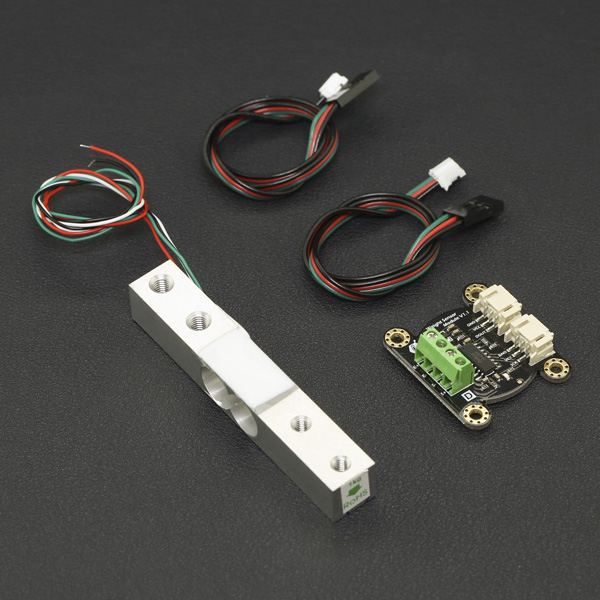

# DFRobot_HX711
- [English Version](./README.md)

HX711是一款为高精度电子秤设计的24位a / D转换芯片。
本示例适用于HX711传感器，通过Arduino读取数据。




## 产品链接 (https://www.dfrobot.com.cn/goods-832.html)
     SEN0160: Gravity: 重量传感器模块（电子称）
	 
## 目录

  * [概述](#概述)
  * [库安装](#库安装)
  * [方法](#方法)
  * [兼容性](#兼容性)
  * [历史](#历史)
  * [创作者](#创作者)
## 概述
提供一个Arduino库，通过从HX711读取数据来获得质量。

## 库安装

要使用这个库，首先下载库文件，将其粘贴到\Arduino\libraries目录中，然后打开示例文件夹并在文件夹中运行演示程序。

## 方法
```C++
    /*!
     * @fn getValue
     * @brief 获取物体质量
     * @return 物体质量, 单位: g
     */
    long getValue();
	
    /*!
     * @fn averageValue
     * @brief获取多此测量后的平均值
     * @param times 多此测量的次数
     * @return 物体质量, 单位: g
     */
    long averageValue(byte times = 25);

    /*!
     * @fn setOffset
     * @brief 去皮
     * @param offset 皮重
     */
    void setOffset(long offset);
	
    /*!
     * @fn setCalibration
     * @brief 设置校准值
     * @param base 校准值
     */
    void setCalibration(float base = 1992.f);

    /*!
     * @fn readWeight
     * @brief 获取去皮后的物体质量
     * @return 物体质量, 单位: g
     */
	float readWeight();
```

## 兼容性

MCU                | Work Well    | Work Wrong   | Untested    | Remarks
------------------ | :----------: | :----------: | :---------: | -----
Arduino Uno        |      √       |              |             | 
Mega2560        |      √       |              |             | 
Leonardo        |      √       |              |             | 
ESP32        |      √       |              |             | 
ESP8266        |      √       |              |             | 
M0        |      √       |              |             | 


## 历史

- 2019/12/31 - Version 1.0.0 released.

## 创作者

Written by wuxiao(xiao.wu@dfrobot.com), 2019. (Welcome to our [website](https://www.dfrobot.com/))
